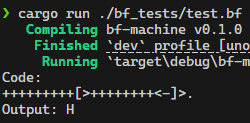
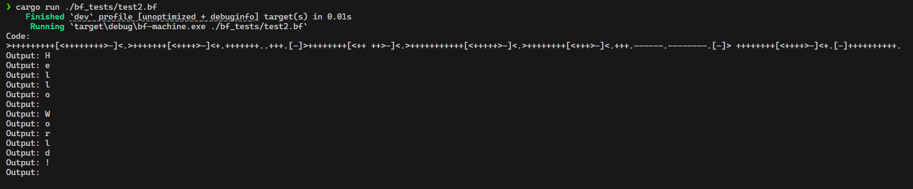
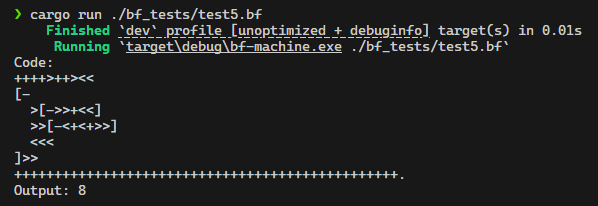
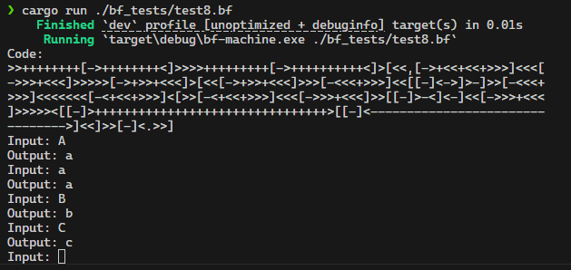

# Brain F\*ck Interpreter

## Requirements

- Rust Development Environment

## Usage

```sh
cargo run {bf code file path}
```

## Showcase

### test.bf



### test2.bf



### test5.bf



### test8.bf


